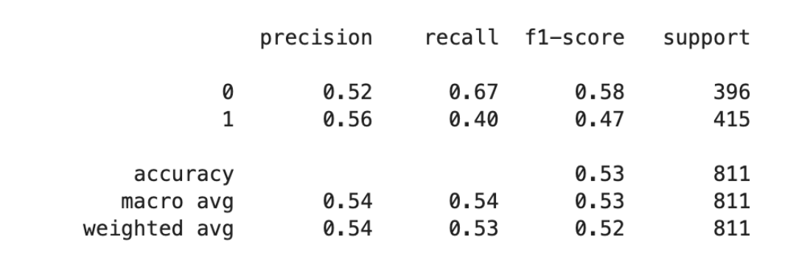
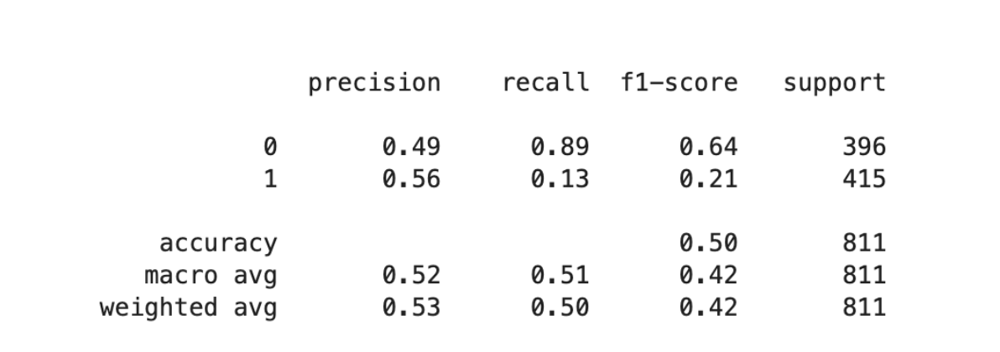
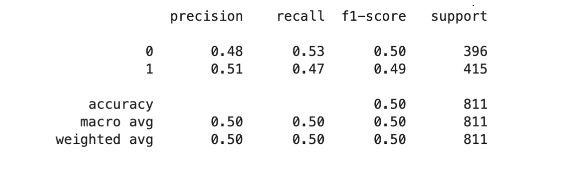

# GBPUSD Price Forecast Using Machine Learning

## Project Overview

Forex markets are characterised by their volatility and complexity, making it difficult to forecast price movements accurately. Machine learning models are able to parse large amounts of data, identify intricate patterns, and make predictions based on historical data; hence,they have become prevalent tools within the realm of financial forecasting. In this project, I will compare the performance of random forest, artificial neural network, and support vector machine models when it comes to forecasting price movement and whether they can outperform the buy-and-hold return through the use of a backtesting environment (Backtesting.py).

My full report can be found [here](Project_Report.pdf).

## Prerequisites

**Python 3**
**Packages:** backtesting.py, pandas, pandas_ta, sklearn, tensorflow, matplotlib, kerastuner

## About the Dataset

The data was retrieved using yfinance library but alternatively can be downloaded [here](https://help.yahoo.com/kb/SLN2311.html). The dataset contains daily historical price data of the GBPUSD pairing ranging from 01/12/2003 - 05/05/2023.

### Attribute Information:

- (date) Date
- (int) Open
- (int) High
- (int) Low
- (int) Close
- (int) Volume
- (int) Dividends
- (int) Stock Splits

## Data Preprocessing

- Dropped 'Volume', 'Dividends' and 'Stock Splits' columns as they are not relevant to indicator calculation
- Created a new target column with 0 indicating a price decrease next day, while 1 indicator a price increase next day. This was done as a reference that could be used as the expected output classfication of each of our models.
- Simple Moving Average (SMA), Relative Strength Index (RSI), Stochastic Oscillator and Moving Average Convergence Divergence (MACD) indicators were created and appended to the dataframe to use as input features for prediction.

## Model Building

The dataset was split using an 80:20 ratio for training and testing respectively.

The three models that were tested were Artificial Neural Networks, Random Forest and Support Vector Machines. Each of the models had the same set of input features and were tasked with predicting the next day price action of GBPUSD (either 1 or 0 indicated as up or down respectively). Each of the models underwent hyperparameter tuning as specified in 3.3 section of the [report](Project_Report.pdf).

## Model Evaluation

Random Forest:

SVM:

ANN:

In terms of overall classification accuracy, it is clear to see that the random forest model performed best. However, SVM performed the best at accurately predicting downward trends. For a full breakdown of each of the models' strengths and weaknesses, as well as a more in depth look of the evaluation metrics used, see sections 3.4 and 4.
